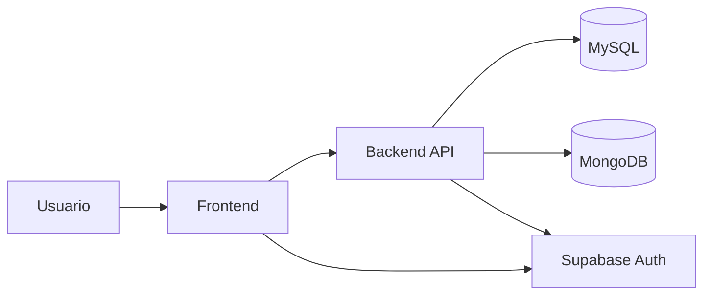
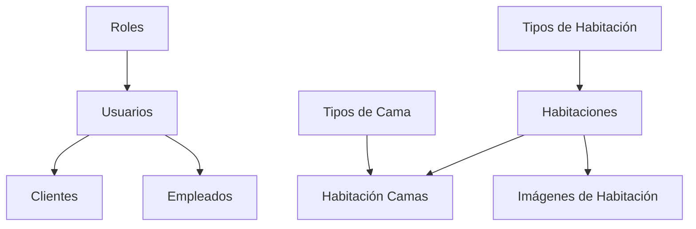
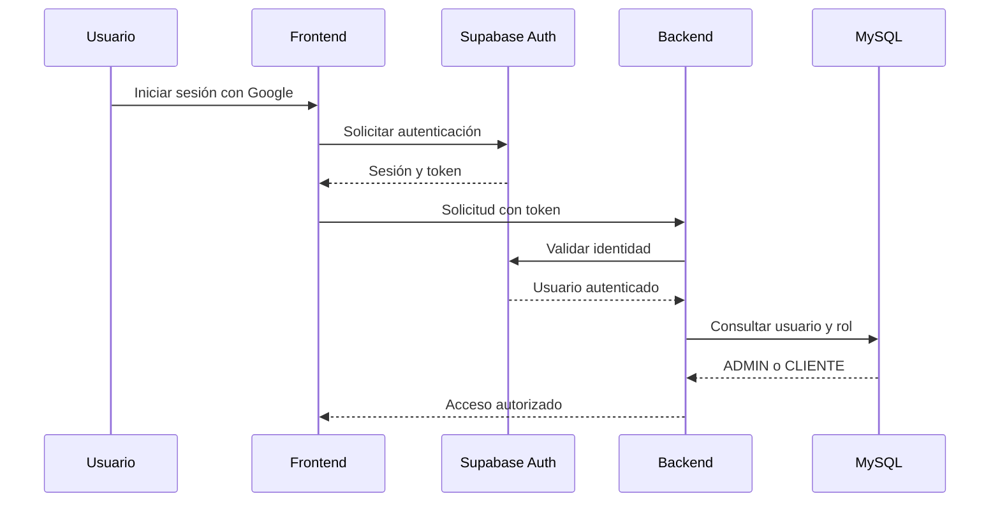
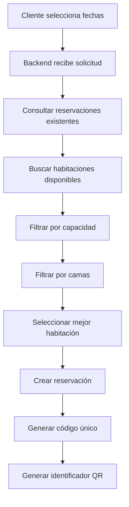
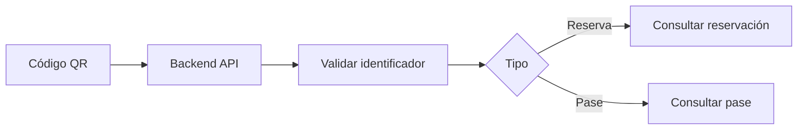

# ARQUITECTURA DEL SISTEMA

## HOTEL WALL STREET

### Sistema Web Integral de Gestión Hotelera

## 1. Introducción

HOTEL WALL STREET será desarrollado como un sistema web modular con separación entre la interfaz de usuario, la lógica del negocio, la autenticación y el almacenamiento de información.

La arquitectura del proyecto busca mantener una organización clara entre frontend, backend y bases de datos.

El sistema utilizará MySQL como base de datos relacional, MongoDB como base de datos no relacional y Supabase Auth para la autenticación de usuarios.

## 2. Arquitectura general

La aplicación estará dividida en los siguientes componentes principales:

* Frontend.
* Backend.
* MySQL.
* MongoDB.
* Supabase Auth.
* Servicios externos.
* Entorno de despliegue.

La comunicación principal del sistema seguirá el siguiente flujo:



El usuario interactuará con el frontend.

El frontend enviará solicitudes al backend mediante una API.

El backend procesará las reglas del negocio y se comunicará con MySQL o MongoDB según el tipo de información requerida.

Supabase Auth será utilizado para autenticar e identificar a los usuarios.

## 3. Frontend

El frontend será responsable de presentar la interfaz gráfica del sistema y permitir la interacción del usuario.

Entre sus responsabilidades se encuentran:

* Mostrar la página principal del hotel.
* Mostrar habitaciones.
* Mostrar fotografías.
* Consultar disponibilidad.
* Permitir realizar reservaciones.
* Mostrar pases diarios.
* Permitir utilizar cupones.
* Mostrar códigos QR.
* Mostrar actividades.
* Permitir participar en el foro.
* Mostrar comentarios y calificaciones.
* Proporcionar el panel administrativo.

El frontend no se conectará directamente a MySQL ni MongoDB.

La información será solicitada mediante el backend.

### Página principal

La página principal tendrá un diseño corporativo, ejecutivo y premium.

La sección inicial utilizará un carrusel dinámico de imágenes como fondo.

El carrusel ocupará:

* 100% del ancho de la ventana.
* 100% del alto de la ventana.

Las imágenes representarán:

1. Fachada corporativa del hotel.
2. Suite presidencial ejecutiva.
3. Business Center o helipuerto.

Las imágenes cambiarán automáticamente cada cinco o seis segundos.

La transición utilizará un efecto de desvanecimiento.

Sobre las imágenes se aplicará una capa oscura semitransparente.

Sobre esta capa se mostrará una tarjeta flotante con efecto de cristal oscuro.

## 4. Backend

El backend será desarrollado utilizando Node.js.

Será responsable de implementar la lógica principal del sistema.

Entre sus responsabilidades se encuentran:

* Validar los datos recibidos.
* Verificar la identidad del usuario.
* Verificar los roles.
* Gestionar clientes.
* Gestionar empleados.
* Gestionar habitaciones.
* Consultar disponibilidad.
* Procesar reservaciones.
* Asignar habitaciones automáticamente.
* Gestionar servicios.
* Gestionar actividades.
* Procesar pases diarios.
* Validar cupones.
* Generar códigos de cupón.
* Generar identificadores para códigos QR.
* Consultar códigos de acceso.
* Procesar información del foro.
* Registrar acciones importantes.

El backend expondrá una API utilizada por el frontend.

La estructura prevista será:

```text
backend/
└── src/
    ├── config/
    ├── controllers/
    ├── middlewares/
    ├── models/
    ├── routes/
    ├── services/
    ├── utils/
    └── app.js
```

### Controllers

Los controladores recibirán las solicitudes HTTP y devolverán las respuestas correspondientes.

### Routes

Las rutas definirán los endpoints disponibles en la API.

### Services

Los servicios contendrán la lógica principal del negocio.

Por ejemplo:

* Verificación de disponibilidad.
* Asignación automática.
* Generación de cupones.
* Validación de cupones.
* Generación de identificadores únicos.

### Middlewares

Los middlewares se utilizarán para procesar solicitudes antes de llegar al controlador.

Se utilizarán principalmente para:

* Validar autenticación.
* Verificar roles.
* Validar solicitudes.
* Manejar errores.

### Models

Los modelos representarán el acceso a la información almacenada en las bases de datos.

## 5. Base de datos relacional MySQL

MySQL será la base de datos principal para la información estructurada del hotel.

La base de datos se llamará:

`hotel_wall_street`

MySQL almacenará información relacionada con:

* Roles.
* Usuarios.
* Clientes.
* Empleados.
* Habitaciones.
* Tipos de habitaciones.
* Tipos de camas.
* Camas por habitación.
* Imágenes de habitaciones.
* Reservaciones.
* Visitantes.
* Servicios.
* Actividades.
* Pases diarios.
* Cupones.
* Códigos de acceso.

La base de datos utilizará claves primarias y claves foráneas para mantener relaciones entre la información.

Ejemplo de relación:



MySQL será utilizado principalmente para procesos importantes del negocio que requieren información relacionada y consistente.

## 6. Base de datos no relacional MongoDB

MongoDB será utilizado para almacenar información documental y dinámica.

Las colecciones previstas son:

* foro_publicaciones.
* comentarios_hotel.
* reportes_foro.
* auditoria.

MongoDB permitirá manejar estructuras de información más flexibles.

Por ejemplo, una publicación del foro podrá contener un conjunto variable de respuestas.

Ejemplo:

```json
{
  "usuarioId": 15,
  "titulo": "¿Qué actividad recomiendan?",
  "contenido": "Visitaré el hotel durante tres días.",
  "respuestas": [
    {
      "usuarioId": 20,
      "contenido": "Te recomiendo la actividad nocturna."
    }
  ]
}
```

MongoDB también será utilizado para almacenar registros de auditoría.

Estos registros permitirán conocer acciones importantes realizadas dentro del sistema.

## 7. Autenticación mediante Supabase

Supabase Auth será utilizado para autenticar a los usuarios.

El sistema estará preparado para permitir inicio de sesión mediante Google.

Supabase será responsable de:

* Autenticación.
* Identificación del usuario.
* Sesión.
* Tokens de acceso.

MySQL no almacenará contraseñas de usuarios.

La tabla `usuarios` almacenará el identificador único generado por Supabase.

El flujo de autenticación será:



## 8. Sistema de roles

El sistema contará inicialmente con dos roles:

### ADMIN

Podrá acceder al panel administrativo.

Podrá gestionar:

* Habitaciones.
* Clientes.
* Empleados.
* Reservaciones.
* Servicios.
* Actividades.
* Pases.
* Cupones.
* Foro.

### CLIENTE

Podrá:

* Consultar habitaciones.
* Realizar reservaciones.
* Consultar sus reservaciones.
* Adquirir pases diarios.
* Consultar sus códigos QR.
* Utilizar cupones.
* Participar en actividades.
* Publicar comentarios.
* Calificar el hotel.
* Participar en el foro.

El backend verificará el rol antes de ejecutar funciones restringidas.

## 9. Arquitectura de reservaciones

El sistema de reservaciones estará centralizado en el backend.

El flujo previsto será:



La asignación automática buscará la habitación disponible que se adapte mejor a la cantidad de visitantes y camas solicitadas.

## 10. Códigos QR

Los códigos QR no almacenarán información personal completa.

Cada código QR contendrá únicamente un identificador único.

Ejemplo:

`HWS-QR-A7KF92X1`

El backend utilizará este identificador para consultar la información asociada.

El código podrá identificar:

* Una reservación.
* Un pase diario.

Flujo:



## 11. Cupones de descuento

Los códigos de cupón serán generados en el backend.

El sistema deberá garantizar que cada código sea único.

Ejemplo:

`WALL-A8F2K9`

Antes de aplicar un cupón, el backend verificará:

* Que el código exista.
* Que esté activo.
* Que la fecha sea válida.
* Que no haya vencido.
* Que tenga usos disponibles.

## 12. Comunicación entre componentes

La arquitectura general seguirá el modelo:

```text
USUARIO
   ↓
FRONTEND
   ↓
BACKEND API
   ↓
LÓGICA DEL NEGOCIO
   ↓
MYSQL / MONGODB
```

La autenticación seguirá el modelo:

```text
USUARIO
   ↓
GOOGLE
   ↓
SUPABASE AUTH
   ↓
TOKEN
   ↓
BACKEND
   ↓
ROL DEL USUARIO
```

## 13. Variables de entorno

Las credenciales y configuraciones sensibles no deberán almacenarse directamente dentro del código.

Se utilizarán variables de entorno.

Ejemplo:

```env
DB_HOST=localhost
DB_PORT=3306
DB_USER=root
DB_PASSWORD=YOUR_PASSWORD
DB_NAME=hotel_wall_street

MONGODB_URI=YOUR_MONGODB_URI

SUPABASE_URL=YOUR_SUPABASE_URL
SUPABASE_ANON_KEY=YOUR_SUPABASE_ANON_KEY
```

El archivo `.env` no deberá compartirse.

El proyecto proporcionará un archivo `.env.example`.

## 14. Despliegue

El sistema estará preparado para despliegue web.

El entorno previsto será Vercel.

Las variables de entorno necesarias deberán configurarse en la plataforma de despliegue.

La arquitectura deberá mantener separadas las configuraciones locales de las configuraciones utilizadas durante el despliegue.

## 15. Estructura general del proyecto

```text
HOTEL-WALL-STREET/
│
├── frontend/
│
├── backend/
│   └── src/
│       ├── config/
│       ├── controllers/
│       ├── middlewares/
│       ├── models/
│       ├── routes/
│       ├── services/
│       └── utils/
│
├── database/
│   ├── mysql/
│   │   ├── schema.sql
│   │   ├── seed.sql
│   │   └── README.md
│   │
│   └── mongodb/
│       └── README.md
│
├── docs/
│   ├── REQUERIMIENTOS.md
│   └── ARQUITECTURA.md
│
├── README.md
├── .gitignore
└── .env.example
```

## 16. Decisión arquitectónica

HOTEL WALL STREET utilizará una arquitectura modular con separación entre frontend y backend.

MySQL será responsable de la información estructurada y relacional del negocio.

MongoDB almacenará información documental y dinámica.

Supabase Auth gestionará la autenticación e identidad de usuarios.

El backend centralizará las reglas del negocio y el acceso a las bases de datos.

Esta separación permitirá mantener el proyecto organizado y facilitar el desarrollo de los diferentes módulos del sistema.
